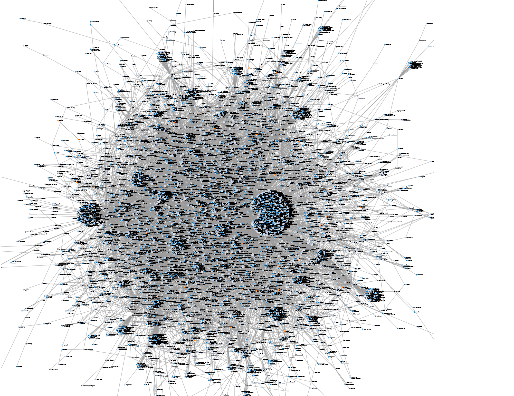

# An Information Theoretic Analysis of the English Language Dictionary

A visualization of a small subset of the core and kernal of the English language dictionary. Words are directionally connected to words that they are used in order to define.

A visualization of about 10,000 words in the English language dictionary.
