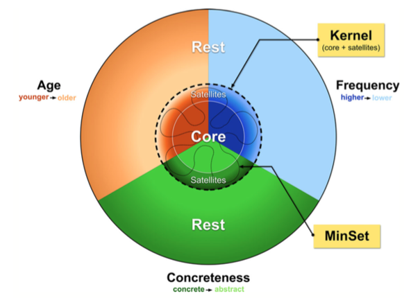
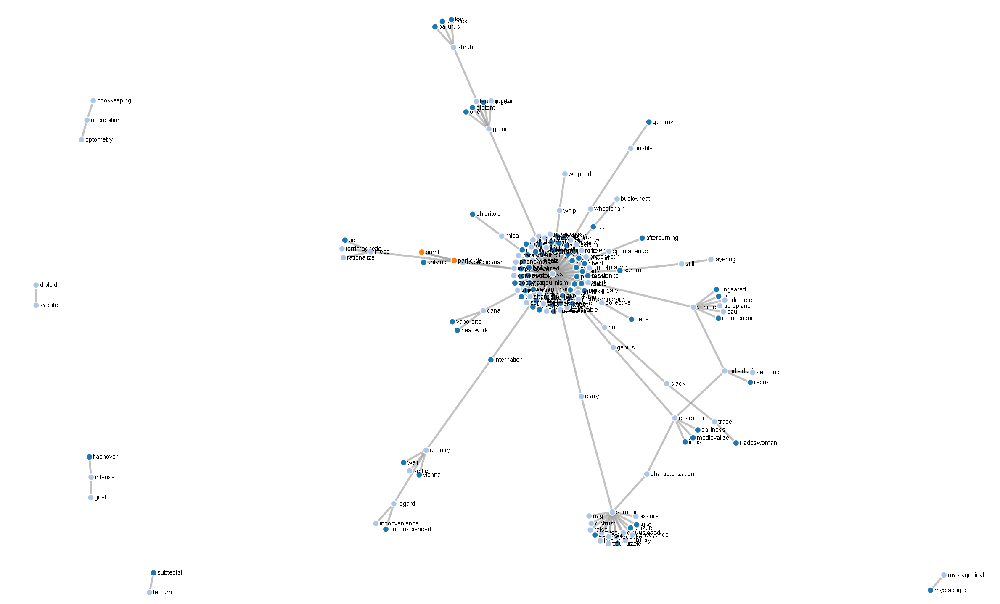
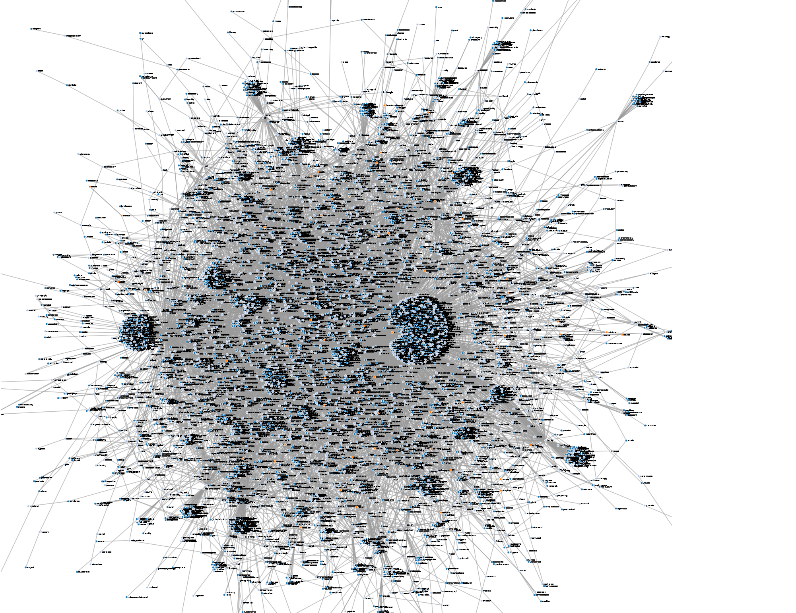

# An Information Theoretic Analysis of the English Language Dictionary
Researcher Vincent-Lamarre and colleagues demonstrate that dictionaries
reveal a latent structure in human languages when represented as a directed
graph, where a given word U is connected to another word V if the word U is
used in the definition of the word V.

<!--  -->
<!--  -->
(Figures obtained from Vincent-Lamarre and colleague's 2016 paper - "The Latent Structure of Dictionaries")

A visualization of a small subset of the core and kernel of the English language dictionary.

A visualization of about 10,000 words in the English language dictionary.

## Resources
Vincent-Lamarre, P., Massé, A. B., Lopes, M., Lord, M., Marcotte, O., & Harnad, S. (2016). The Latent Structure of Dictionaries. Topics in Cognitive Science, 8(3), 625-659. doi:10.1111/tops.12211
