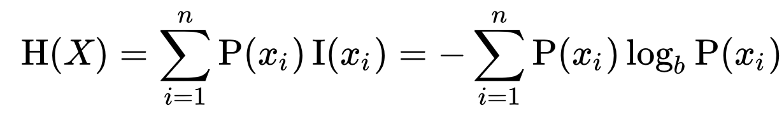
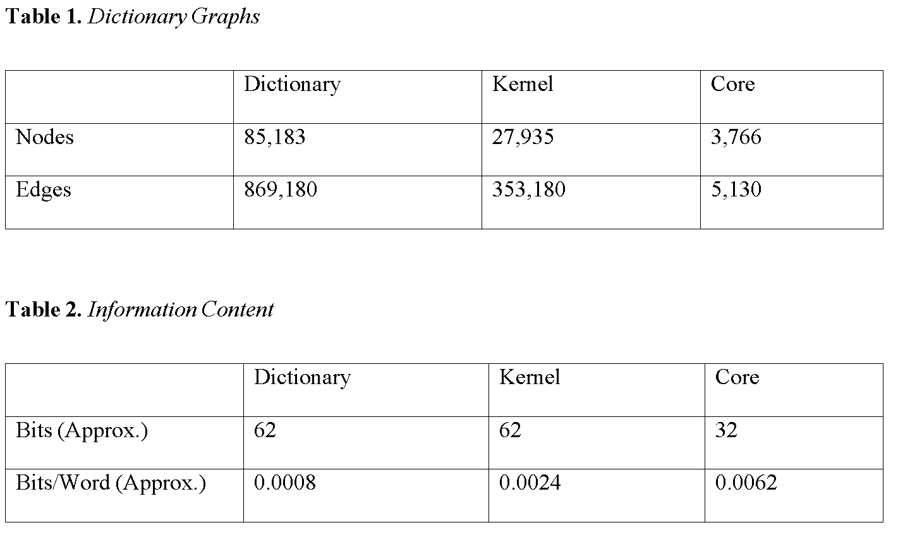

# An Information Theoretic Analysis of an English Language Dictionary
Researcher Vincent-Lamarre and colleagues demonstrate that representing dictionaries as directed graphs reveals a latent structure in human languages, where a given word U is connected to another word V if the word U is
used in the definition of the word V.

### Figure 1 - Latent Structure Visualization
(Figures obtained from Vincent-Lamarre and colleague's 2016 paper - "The Latent Structure of Dictionaries")

These researchers demonstrated that by visualizing a dictionary as a
directed graph in this way, you reveal a layered structure.

A dictionary's Kernel Is the set of words necessary for defining every other word in the dictionary.

A dictionary's Core is the set of strongly connected words within the Kernel. Words U and V are strongly connected if each appears in the definition of the other.

## Our Goal:

For this project, we were interested in analyzing and characterizing the
defining power of the different dictionary components defined by Vincent-Lamarre
et al.

### Figure 2 - Shannon's Entropy Equation

We used Shannon's entropy equation in order to measure the amount of information implicit in each component of the dictionary.

## Result

## D3 Visualizations

Lastly, we created some visualizations of random subsets of our directed graph created from the dictionary we constructed.

A visualization of a small subset of the core and kernel of the English language dictionary.

A visualization of about 10,000 words in the English language dictionary.

## Resources
Vincent-Lamarre, P., Massé, A. B., Lopes, M., Lord, M., Marcotte, O., & Harnad, S. (2016). The Latent Structure of Dictionaries. Topics in Cognitive Science, 8(3), 625-659. doi:10.1111/tops.12211

A big thanks to Oxford Dictionaries for access to their API for the purpose of this project.
